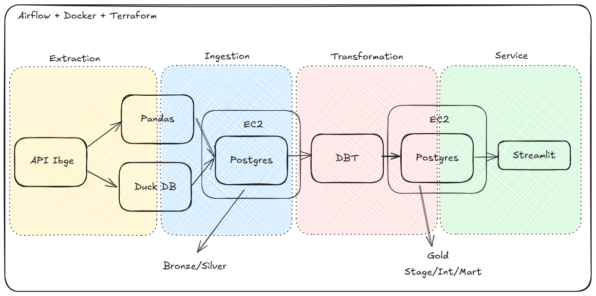
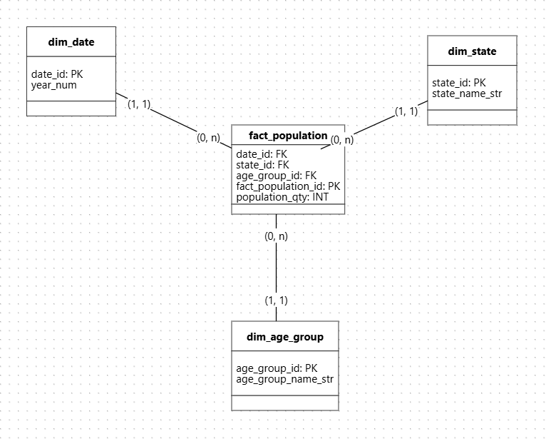
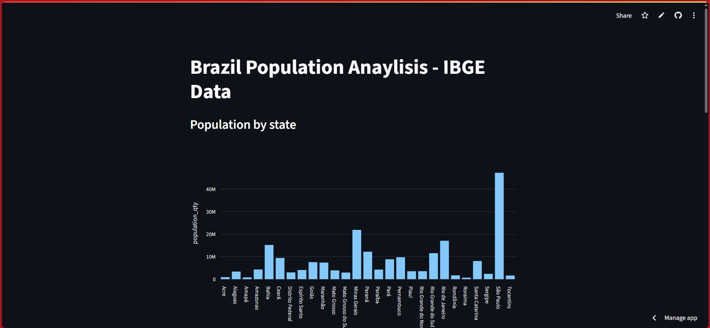
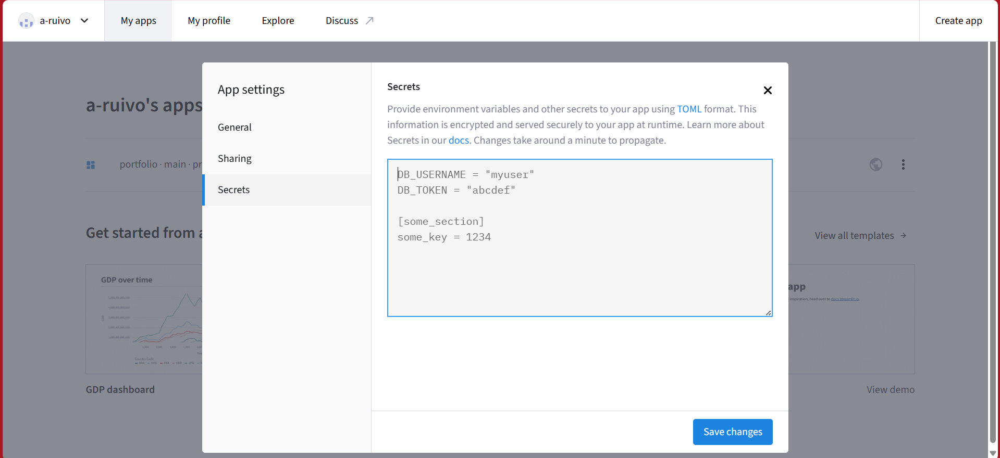
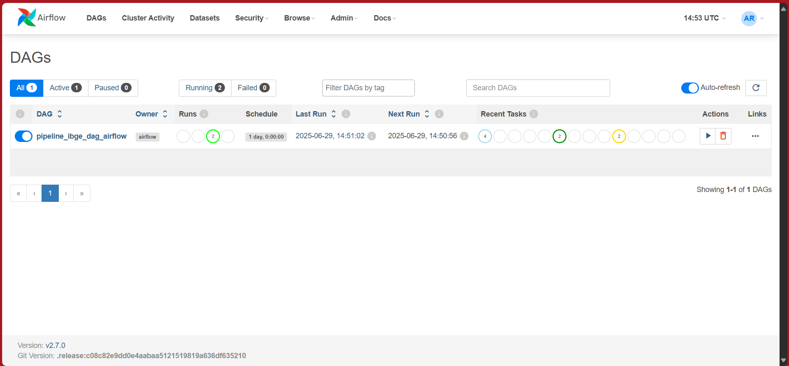

# Project 1 - Data from IBGE using airflow + EC2 + docker + streamlit

**Project 1** is a personal initiative focused on strengthening my skills with a variety of tools and applying them **in practice**. The project involved the following key steps:
- Extracting data from the IBGE API and modeling it using a star schema.
- Storing the data in a remote environment.
- Making the data accessible in web.
- Automating the process with terraform + airflow + docker.

The stack included: PostgreSQL, EC2, Airflow, Terraform, Streamlit, and DBT.

Project:

Dimensional model:

## Steps

1. Using the Linux terminal, install the necessary programs.: AWS CLI, Python, VS Code, Terraform, Docker and DBT. 
> I chose to work with Linux to deepen my understanding of the operating system. However, I opted for WSL (Windows Subsystem for Linux) to maintain compatibility with essential tools like Tableau, which aren't supported on Linux.
2. Create the file [population_extraction.py](pipeline/1.extraction/population_extraction.py) to extract the data from the ibge api and stores it in duckdb.
3. Create the file [main.tf](infra/main.tf) with the specifications of the remote environment you want to create.
4. Create the file [population_ingestion.py](pipeline/2.ingestion/population_ingestion.py) in python to import the data from duckdb to a postgreSQL in a remote EC2 environment.
5. Create DBT models transforming the data:[DBT models folder](pipeline/3.transformation/dbt_project1/models/)
6. Create an file [app.py](pipeline/4.service/streamlit/app.py) defining the connections and visualisation options you want to build.
> Connect your github account to streamlit indicating where it should look for the file and wait for it to run.

> To avoid leaking credentials, set up variables within the streamlit application.

10. Create the files [docker_compose.yml](infra/docker/docker_compose.yml) and [Dockerfile](infra/docker/Dockerfile) to activate airflow.
11. Create the file [start_project1.sh](start_project1.sh) to execute the step with one command.
> In the airflow the dag should appear like this:
